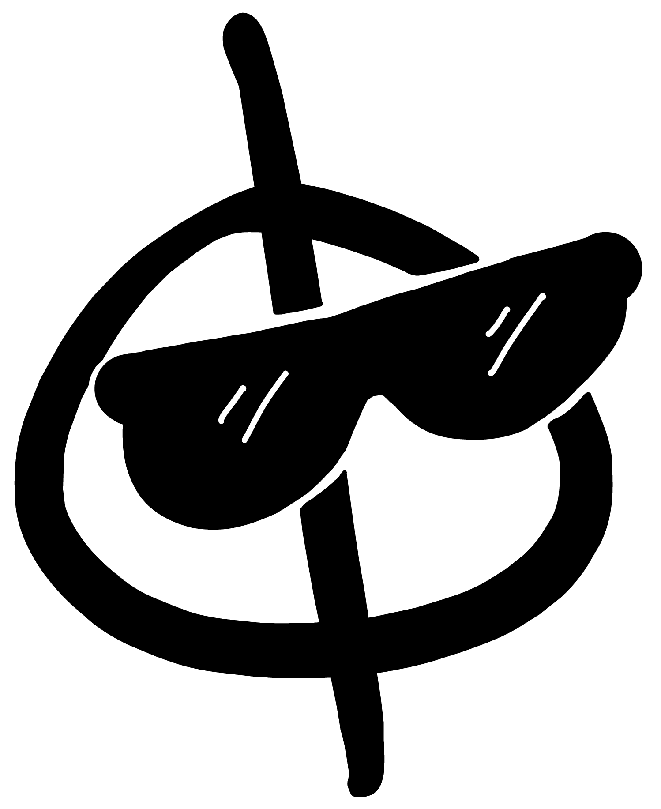

# escut

<p align="left">
  <picture>
    <source media="(prefers-color-scheme: dark)" srcset="assets/escut-dark.png?v=1">
    <source media="(prefers-color-scheme: light)" srcset="assets/escut-light.png?v=1">
    
  </picture>
</p>

**E**quation for **SC**reening with **U**nified **T**reatment &nbsp;·&nbsp; *(Escut means shield in Catalan)*

A Python library for numerically solving the master equation for screening in luminal Horndeski gravity, including the Vainshtein, Chameleon and Phaedrus mechanisms.

The code solves the nonlinear dimensionless spherical boundary-value-problem (BVP) for a scalar field perturbation $Q(x)$, $x = r/R$:

$$
\frac{1}{x^2}\frac{d}{dx}\left[x^2 \left(A + D Q\right) Q_x\right] + x^2 Q(B + CQ) - \frac{1}{x^2}\frac{d^2}{dx^2}\left[F x^2 Q_x^2\right] + E x^2 Q_x^2 + S x^2 \tilde{\rho}(x) = 0,
$$

with a smoothed top-hat density profile $\delta(x)$, where x is the dimensionless radial coordinate $x = r/R$, with $R$ being the radius of the source.

| Coefficient | Physics |
|---|---|
| `A` | Linear kinetic term |
| `B`, `C` | Chameleon screening |
| `D`, `E` | Phaedrus screening |
| `F` | Vainshtein screening |
| `S` | Source |

---

## Installation

Clone the repo and install in editable mode (a virtual environment is recommended):

```bash
git clone https://github.com/Hi-COLACode/escut.git
cd escut
python -m venv .venv
source .venv/bin/activate        # Windows: .venv\Scripts\activate
pip install -e .
```

Dependencies: `numpy`, `scipy`, `matplotlib` (all installed automatically).

---

## Examples

See the Jupyter notebooks for worked examples of each mechanism: [Chameleon](notebooks/chameleon-screening.ipynb), [Vainshtein](notebooks/vainshtein-screening.ipynb), and [Phaedrus](notebooks/phaedrus-screening.ipynb).

---

## Citation

If you use this code, please cite the associated paper: [2605.04154](https://arxiv.org/abs/2605.04154).

---

## Contact

For questions or comments, please contact sergi.sirera@port.ac.uk.

> Parts of this codebase were developed with the assistance of GitHub Copilot. All physics formulations and scientific results were designed and verified by the authors.

---


